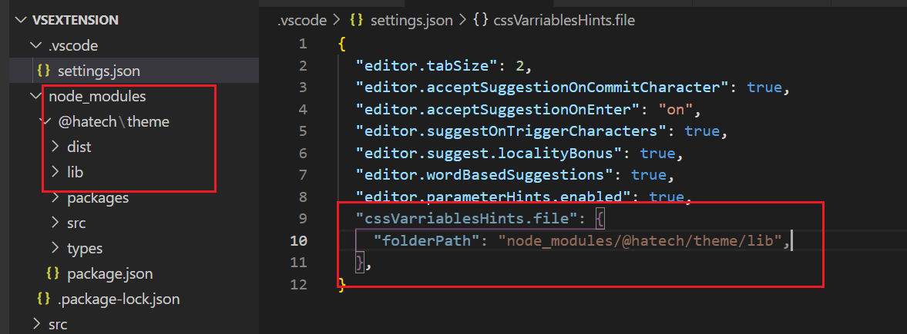
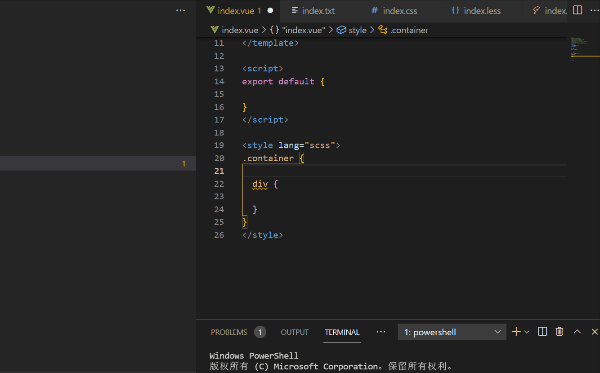

<!--
 * @Author: wangyunbo
 * @Date: 2021-05-19 23:57:46
 * @LastEditors: wangyunbo
 * @LastEditTime: 2021-05-31 14:01:45
 * @Description: file content
 * @FilePath: \hatech-web-css-hints\README.md
-->

# css-variable-hints

`css-variables`变量的提示插件,通过输入`-` 或 `#`触发。


Be sure that you have one of supported language modes selected in right bottom of your vscode window:
* css
* postcss
* scss
* less
* vue


## Extension Configuration

在项目的`.vscode/settings.json`文件中配置css变量文件的路径数组，如下所示：
Minimal configuration file:
```
{
  ...
  // 本地资源变量文件路径
  "cssVarriablesHints.file": {
    folderPath: "target folder's relative path to project",
  },
  ...
};
```

 
 
### 用法：   

1. 搜索插件名：`css-variables-hints`, 并安装。    
2. 修改项目根目录下的`.vscode/settings.json`：        
```javascript
{
  ...
  // 本地资源变量文件路径列表
  "cssVarriablesHints.file": {
    "folderPath": "node_modules/@hatech/theme/lib",
  },
  ...
};
```

3. 在vue文件中写样式的时候，通过`-`或`#`触发提示，如果没有提示，(1)重启编辑器试下，(2)检查下`.vscode/settings.json`配置是否不正确。


